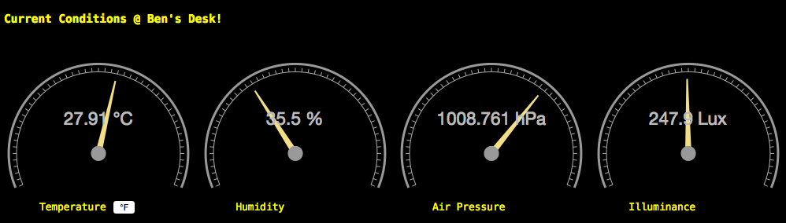

TFWS: Tinkerforge WeatherStation
=========
Node based server for displaying information from the Tinkerforge
WeatherStation. Uses <http://hapijs.com/> and <http://fastly.github.io/epoch/> to display some nice dials.



Installation
------------
1. copy ```local.json.dist``` to local.json, fill in values if different
2. ```npm install```
3. ```forever run app.js```
4. Go to the url you specified in local.json
